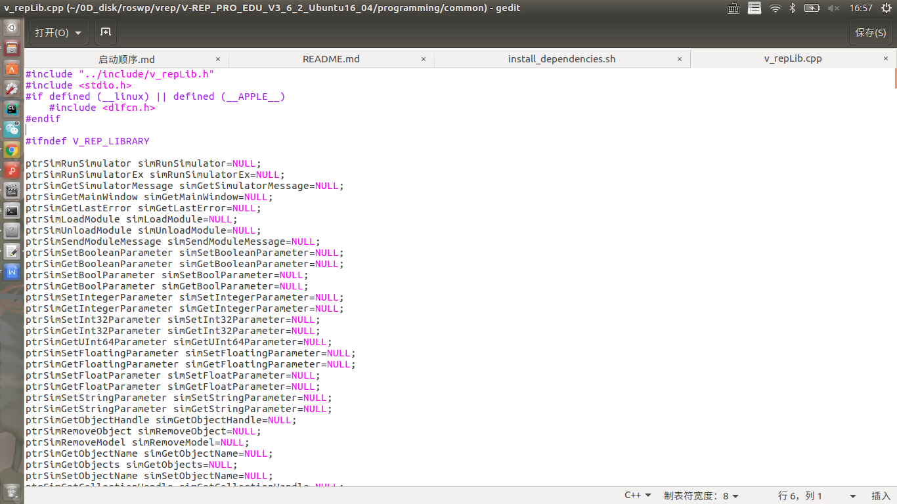

# installers_plan
the dependencies install for the motion planning algorithm
some tar.gz or .zip file is too big to push into github, please ask me privately to share with you.

## 1.编译
### 1）grid_map_core
Report an error: 
<table><tr><td bgcolor=MintCream>
Could not find a package configuration file provided by "grid_map_core" with any of the following names: 
grid_map_coreConfig.cmake 
grid_map_core-config.cmake
</td></tr></table>

Solution: 
``sudo apt-get update`` 
``sudo apt-get -y install ros-kinetic-pcl-ros ros-kinetic-costmap-2d ros-kinetic-grid-map``

### 2）ceres solver
Report an error: 
<table><tr><td bgcolor=MintCream>
fatal error: ceres/ceres.h: 没有那个文件或目录
</td></tr></table>

Solution: 
``bash install_ceres.sh``

### 3）IPOPT solver
Report an error: 
<table><tr><td bgcolor=MintCream>
A required package was not found
Call Stack (most recent call first): 
/usr/share/cmake-3.5/Modules/FindPkgConfig.cmake:532 (_pkg_check_modules_internal)
cmake/FindIPOPT.cmake:3 (pkg_check_modules) 
CMakeLists.txt:24 (find_package)
</td></tr></table>

Solution:  
Install cppad first： 
``bash install_cppad.sh`` 
Then install ipopt： 
``bash ./ipopt_install/install_ipopt.bash`` 

if there occurs some error when test the example： 
<table><tr><td bgcolor=MintCream>
/usr/bin/ld: 找不到 -lgfortran  
</td></tr></table>

then: 
Solution: 
``
open terminal -> locate gfortran.so -> sudo cp [the folder that includes gfortran.so]/gfortran.so /user/local/lib`` 

Reason:  
The default search dependency library path of the system is: /usr/local/lib.  
Reference:[the reason Couldn't find the so link](https://blog.csdn.net/weixin_43723326/article/details/103427351) ; 
[Couldn't find the so link](https://www.cnblogs.com/feifanrensheng/p/10039959.html)  

### 4）benchmark
<table><tr><td bgcolor=MintCream>
Could not find a package configuration file provided by "benchmark" with
any of the following names: 
benchmarkConfig.cmake 
benchmark-config.cmake
</td></tr></table>

Solution: 
``bash install_googlebenchmark.sh``

### 5）rosparam handler
<table><tr><td bgcolor=MintCream>
Could not find a package configuration file provided by "rosparam_handler"
with any of the following names: 
rosparam_handlerConfig.cmake 
rosparam_handler-config.cmake
</td></tr></table>

Solution: 
``sudo apt-get install ros-kinetic-rosparam-handler``

### 6)OsqpEigen
<table><tr><td bgcolor=MintCream>
Could not find a package configuration file provided by "OsqpEigen" with
  any of the following names: 
OsqpEigenConfig.cmake  
osqpeigen-config.cmake  
</td></tr></table>

Solution:
``bash install_osqp.sh``

### 7)autoreconf
<table><tr><td bgcolor=MintCream>
autoreconf: not found
</td></tr></table>

Solution: 
``sudo apt-get install autoconf automake libtool``

### 8)NLOPT solver
<table><tr><td bgcolor=MintCream>
/usr/share/cmake-3.5/Modules/FindPkgConfig.cmake:532 (_pkg_check_modules_internal) 
  cmake/FindNLOPT.cmake:11 (pkg_check_modules) 
  CMakeLists.txt:31 (find_package)
</td></tr></table>

Solution:
``bash ./installers_plan/install_install_nlopt.sh``

### 9）qt_build
<table><tr><td bgcolor=MintCream>
Could not find a package configuration file provided by "qt_build" with any
  of the following names: 
qt_buildConfig.cmake 
qt_build-config.cmake
</td></tr></table>

Solution： 
``sudo apt-get install ros-kinetic-qt-build``

### 10)rviz_visual_tools
<table><tr><td bgcolor=MintCream>
Could not find a package configuration file provided by "rviz_visual_tools"
  with any of the following names: 
rviz_visual_toolsConfig.cmake  
rviz_visual_tools-config.cmake  
</td></tr></table>

Solution:
``sudo apt-get install ros-kinetic-rviz-visual-tools ``

### 11)OpenCV2.4 version
<table><tr><td bgcolor=MintCream>
Could not find a configuration file for package "OpenCV" that is compatible
  with requested version "2.4".
</td></tr></table>

Solution: 
``bash install_opencv2_4.sh``

if there occurs the problem that the configuration incomplete: 
<table><tr><td bgcolor=MintCream>
CMake Error at cmake/OpenCVDetectCXXCompiler.cmake:85 (list)
</td></tr></table>
or complied failed:  
<table><tr><td bgcolor=MintCream>
/usr/include/c++/7/cstdlib:75:15: fatal error: stdlib.h: 没有那个文件或目录  
</td></tr></table>

then: 
``bash install_opencv2_4gcc6.sh``

Reason:  
The version of gcc is higher than the opencv2.4.13 requires.
Reference:[CMake Error: the version of gcc is higher than the opencv2.4.13 requires](https://www.jianshu.com/p/7d117fa4924f) and [Make install error: the version of gcc is higher than the opencv2.4.13 requires](https://blog.csdn.net/Stackingrule/article/details/90146828)

Check the version of opencv: 
``pkg-config --modversion opencv``

### 12)FCL
<table><tr><td bgcolor=MintCream>
A required package was not found
Call Stack (most recent call first): 
  /usr/share/cmake-3.5/Modules/FindPkgConfig.cmake:532 (_pkg_check_modules_internal) 
  cmake/FindFCL.cmake:12 (pkg_check_modules) 
  CMakeLists.txt:42 (FIND_PACKAGE)
</td></tr></table>

Solution: 
``bash install_libccd_fcl.sh``

### 13)grid_map_sdf
<table><tr><td bgcolor=MintCream>
Could not find a package configuration file provided by "grid_map_sdf" with
  any of the following names: 
grid_map_sdfConfig.cmake 
grid_map_sdf-config.cmake 
</td></tr></table>

Solution: 
``sudo apt-get install ros-kinetic-grid-map-sdf``

### 14)Protobuf
<table><tr><td bgcolor=MintCream>
A required package was not found
Call Stack (most recent call first): 
  /usr/share/cmake-3.5/Modules/FindPkgConfig.cmake:532 (_pkg_check_modules_internal) 
  cmake/FindProtobuf.cmake:209 (pkg_check_modules) 
  CMakeLists.txt:43 (find_package)
</td></tr></table>

Solution: 
``bash install_googleProtobuf.sh``  

[reference for install](https://github.com/protocolbuffers/protobuf/blob/master/src/README.md); 
[reference about protobuf](https://github.com/protocolbuffers/protobuf)

if report the error when you `catkin_build`:  
<table><tr><td bgcolor=MintCream>
fatal error: google/protobuf/stubs/stringprintf.h: 没有那个文件或目录
</td></tr></table>

Solution: 
Find the QpSpeed package's CMakelist.txt, and add your install path into line 133, like this:  

    include_directories(
        include
		/home/luyaomin/0Disk/ros_dep/protobuf/protobuf-3.13.0/src/
        ${catkin_INCLUDE_DIRS}
        ${Boost_INCLUDE_DIRS}
		${EIGEN3_INCLUDE_DIR}
		${PROTOBUF_INCLUDE_DIRS}
		third_lib/qpOASES/include
    )

### 15)tf2_sensor_msgs
<table><tr><td bgcolor=MintCream>
 fatal error: tf2_sensor_msgs/tf2_sensor_msgs.h: 没有那个文件或目录 
</td></tr></table>

 Solution: 
 ``sudo apt-get install ros-kinetic-tf2-sensor-msgs`` 
  

### 16)casadi
<table><tr><td bgcolor=MintCream>
  Could not find a package configuration file provided by "casadi" with any
  of the following names: 
casadiConfig.cmake 
casadi-config.cmake 
</td></tr></table>

Solution: 
``bash install_casadi.sh``  
[**Notice: 
The casadi.tar.gz is too big to push on the github. If you want to use it, please ask me privately**]

### 17)vrep
（1）官网下载安装包：[vrep官网，下载3.6版本即可]
(https://www.coppeliarobotics.com/)
运行脚本：

    bash install_vrep.sh
注意将里面第八行 `VREP_DIR_DEFAULT="/home/luyaomin/0Disk/ros_dep/vrep" #the DIR that you download the VREP tar.xz file`换成自己的安装位置  
（2）vrep和ros的接口安装
实验室 autoSim-ivrc 里的脚本  
（3）运行vrep，在调用实验室的模型的时候，如果有报错，调整：
（注，vrep如果安装的是3_6而不是3_4的话，在执行./install_dependences.sh的时候会报错，此时会报错‘nullptr’ was not declared in this scope，直接进入错误提示里的v_repLib.cpp文件里，将 nullptr 替换为 NULL。（因为nullptr是新标准C++11里添加的，而这个autoSim-ivrc是基于旧版本的，所以无法对nullptr进行识别。） 
修改v_repLib.cpp文件:

使用： 

    roscore

在`vrep_ws`工作空间下，

    source devel/setup.bash
    vrep
之后运行才不会报错，否则会找不到对应的模型。

### 18)state_sampling `abs` report error

将对应文件里的`abs`改为`fabs`： 

    if ((path_length > 30 || path_length > ref_path.back().s * 3 / 4)
            && std::fabs(i - center_id) < std::fabs(nearest_id - center_id)) {
            nearest_id = i;
        }
原因： 
[abs和fabs](https://blog.csdn.net/linwh8/article/details/50754147/)

### 19) 

小细节：
丢失了哪个包，可以去网上搜，如果是ROS_Wiki就有的，可以直接：
`sudo apt-get install ros-kinetic-pkgName` 尝试安装！！！
